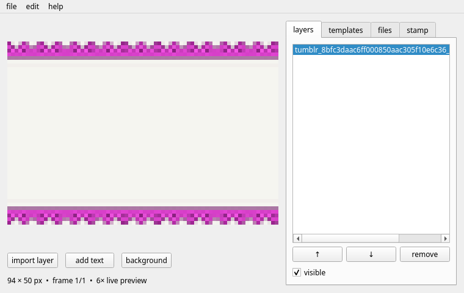

# StampForge



StampForge is a tiny System 7-inspired desktop editor for making 94×50 pixel web stamps. It is designed for Neocities, personal homepages, forum signatures, shrine pages, and other small places where a little image says more than a dashboard.

## What it does

- Draws a true 94×50 canvas and scales it with nearest-neighbour pixels.
- Imports PNG, JPG, WEBP, transparent art, and animated GIFs as layers.
- Loops animated layers in the preview and exports looping GIFs.
- Adds text, solid colour backgrounds, and movable layers.
- Reorders, hides, and removes layers.
- Shows image thumbnails in the templates and files tabs.
- Browses these source folders directly: `PNG`, `DIV`, `GIF`, `BACKGROUND TILES`, and `FAVICON`.
- Crops the current composition to a selected template's alpha mask.
- Exports PNG or GIF at exactly 94×50 pixels.

## Controls

Double-click any thumbnail to add it as a layer. Use the layer arrows to change stacking order and the `x` / `y` controls to nudge the selected layer.

`Ctrl+Z` undoes the last edit. `Ctrl+R` redoes it. The **crop to selected template** button uses the template's transparent edge as the final stamp shape.

## Run it

```sh
python /home/scorn/stampforge/stampforge.py
```

The application launcher is installed at `~/.local/share/applications/stampforge.desktop` and appears under **Graphics → StampForge**.

## Local asset folders

The app's own reusable files live in `/home/scorn/stampforge/files/` and its templates live in `/home/scorn/stampforge/templates/`. Imported assets are copied there; originals are never modified.

## Requirements

Python 3, PySide6, and Pillow. On this workstation those are already installed system-wide.
